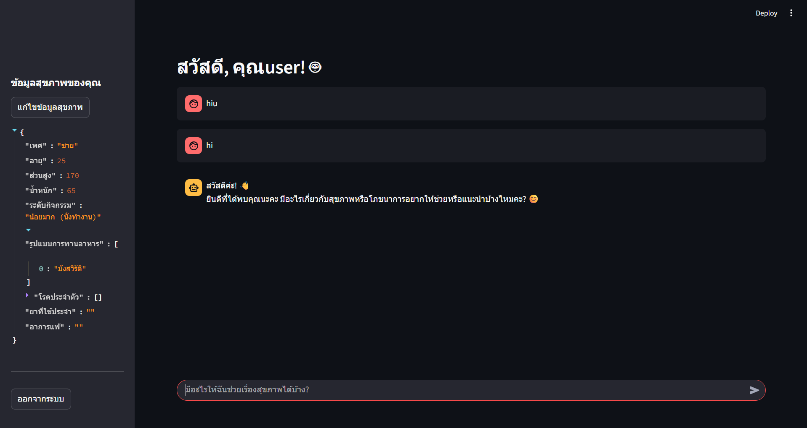

# Ollama Chatbot with Streamlit

This project is a chatbot application that utilizes a Large Language Model (LLM) running locally on your machine via Ollama, with a user-friendly UI built with Streamlit



## Prerequisites

- Python 3.8+
- Install Ollama: Please download and install Ollama from [https://ollama.ai/](https://ollama.ai/)

## Installation and Usage

Follow the steps below to run the application

### Clone the Project

Open your terminal or command prompt and run the following commands

```bash
git clone <your-repo-url>
cd <your-repo-directory>
```

### Step 2: Install Required Libraries

Run this command in your terminal or command prompt

```bash
pip install -r requirements.txt
```
### Step 3: Download the LLM

This project uses the gpt-oss:20b model by default. You must first download this model using the Ollama CLI

```bash
ollama pull gpt-oss:20b
```

If you wish to use other models (e.g., mistral), 

you can change the model name in the app.py file and run the ollama pull command for that model.

### Step 4: Run the Application

Once everything is installed, run the application with the following command

```bash
streamlit run app.py
```
The application will open in your browser, and you can start using it immediately.

If you encounter any issues, please ensure that the Ollama server is running in the background.